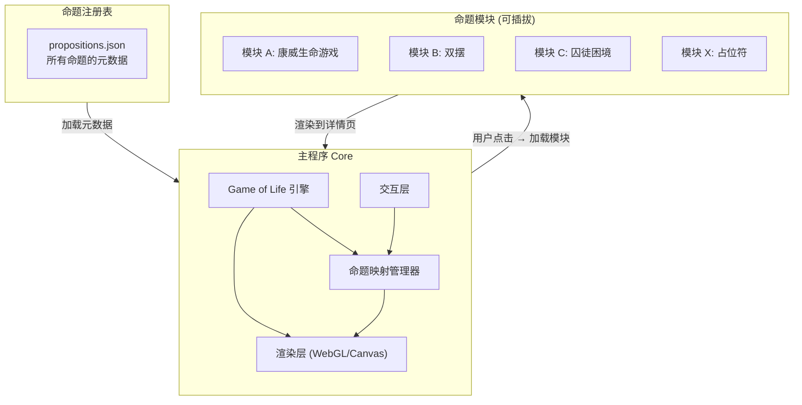
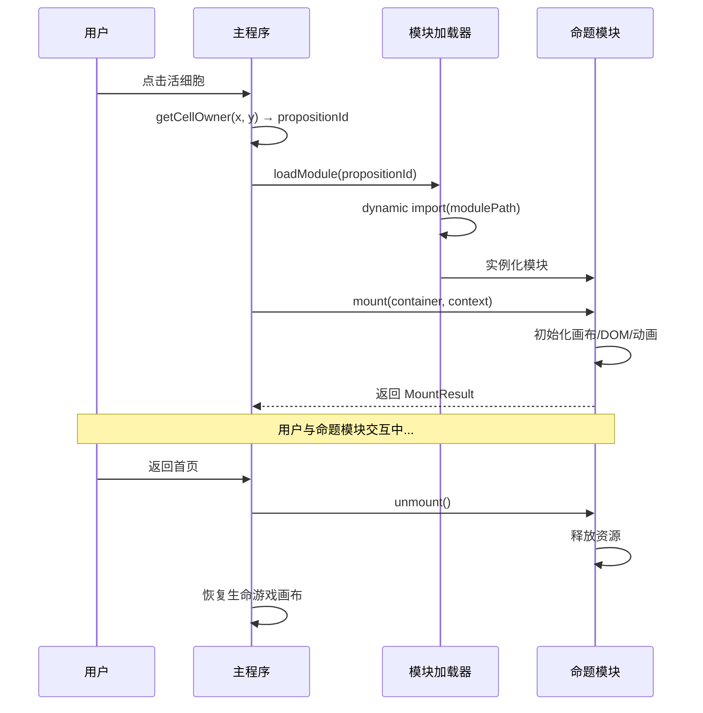

# 技术架构：主程序 + 模块插件系统

## 架构总览



### 核心原则

1. **主程序只管生命游戏 + 导航**，不知道任何命题的具体内容
2. **命题模块是纯粹的独立单元**，通过标准接口对接主程序
3. **模块懒加载**，用户点击像素格时才加载对应模块
4. **注册表驱动**，新增命题只需添加一条注册记录 + 一个模块文件夹

---

## 一、主程序 (Core)

### 1.1 技术栈

| 层 | 选型 | 理由 |
| --- | --- | --- |
| **引擎** | TypeScript | 类型安全，模块接口可强约束 |
| **渲染** | WebGL (PixiJS 或原生) | 百万级格子需要 GPU 渲染 |
| **构建** | Vite | 快速开发 + 懒加载原生支持 |
| **模块加载** | Dynamic import | 按需加载，零冗余 |

### 1.2 主程序模块划分

```
src/
├── core/
│   ├── engine.ts            # 生命游戏引擎（演化计算）
│   ├── renderer.ts          # WebGL 渲染层
│   ├── grid.ts              # 画布网格数据结构
│   └── clock.ts             # 演化时钟（3-5s 节奏 + 渐变控制）
├── mapping/
│   ├── registry.ts          # 命题注册表加载与管理
│   ├── mapper.ts            # 命题 → 像素格映射逻辑
│   └── patterns.ts          # 初始图案库（稳定/振荡/随机）
├── interaction/
│   ├── hover.ts             # hover 命题名称浮层
│   ├── click.ts             # 点击 → 加载模块
│   └── guide.ts             # 首次引导（"点击任何活着的光点"）
├── modules/
│   ├── loader.ts            # 模块动态加载器
│   └── placeholder.ts       # 通用占位符模块
├── ui/
│   └── fallback-list.ts     # 兜底入口（全部命题列表）
├── types/
│   └── module-api.ts        # 模块接口类型定义 ★
├── data/
│   └── propositions.json    # 命题注册表 ★
└── main.ts                  # 入口
```

### 1.3 生命游戏引擎 (`engine.ts`)

```tsx
interface GameEngine {
  // 初始化画布
  init(config: GridConfig): void;

  // 注入命题的初始像素
  seed(placements: PropositionPlacement[]): void;

  // 执行一代演化
  step(): GenerationDelta;

  // 获取指定格子的状态
  getCellState(x: number, y: number): CellState;

  // 获取指定格子所属的命题ID
  getCellOwner(x: number, y: number): string | null;
}

interface GridConfig {
  width: number;              // 画布宽度（格子数）
  height: number;             // 画布高度（格子数）
  cellSize: number;           // 每格像素大小
}

interface CellState {
  alive: boolean;
  owner: string | null;       // 所属命题ID
  color: string;              // 十六进制颜色
}

interface GenerationDelta {
  born: [number, number][];   // 新生格子坐标
  died: [number, number][];   // 死亡格子坐标
  generation: number;         // 当前代数
}
```

### 1.4 演化时钟 (`clock.ts`)

```tsx
interface EvolutionClock {
  interval: number;           // 代际间隔，默认 4000ms
  transitionDuration: number; // 渐变过渡时长，默认 1500ms
  start(): void;
  pause(): void;
  resume(): void;
  onTick(callback: (delta: GenerationDelta) => void): void;
}
```

---

## 二、命题注册表 (`propositions.json`)

每个命题在注册表中是一条记录。主程序**只读注册表**，不关心模块内部实现。

```json
{
  "propositions": [
    {
      "id": "conway-game-of-life",
      "name": "康威生命游戏",
      "category": "涌现与自组织",
      "tier": "S",
      "color": "#4ECDC4",
      "pattern": "stable",
      "patternConfig": {
        "type": "block",
        "count": 20
      },
      "modulePath": "./modules/conway-game-of-life/index.ts",
      "icon": "🔲",
      "description": "4条生死规则：孤独死、拥挤死、存活、繁殖"
    },
    {
      "id": "double-pendulum",
      "name": "双摆",
      "category": "混沌与非线性",
      "tier": "S",
      "color": "#FF6B6B",
      "pattern": "oscillator",
      "patternConfig": {
        "type": "blinker",
        "count": 15
      },
      "modulePath": "./modules/double-pendulum/index.ts",
      "icon": "🔀",
      "description": "确定性系统对初始条件极度敏感"
    },
    {
      "id": "placeholder-example",
      "name": "待开发命题",
      "category": "概率与统计直觉",
      "tier": "B",
      "color": "#95E1D3",
      "pattern": "random",
      "patternConfig": {
        "type": "scatter",
        "count": 5
      },
      "modulePath": null,
      "icon": "❓",
      "description": "即将推出"
    }
  ]
}
```

### 注册表字段说明

| 字段 | 类型 | 必填 | 说明 |  |  |
| --- | --- | --- | --- | --- | --- |
| `id` | string | ✅ | 唯一标识符，kebab-case |  |  |
| `name` | string | ✅ | 命题中文名 |  |  |
| `category` | string | ✅ | 分类（决定颜色） |  |  |
| `tier` | "S" \ | "A" \ | "B" | ✅ | 等级（决定初始图案策略） |
| `color` | string | ✅ | 十六进制颜色（按分类统一） |  |  |
| `pattern` | "stable" \ | "oscillator" \ | "random" | ✅ | 初始图案类型 |
| `patternConfig` | object | ✅ | 图案详细配置（类型 + 数量） |  |  |
| `modulePath` | string \ | null | ❌ | 模块入口路径，null = 使用占位符 |  |
| `icon` | string | ❌ | emoji 图标，hover 时显示 |  |  |
| `description` | string | ❌ | 一句话描述 |  |  |

---

## 三、模块接口规范 ★

**这是整个插件系统的核心契约。** 每个命题模块必须实现此接口。

### 3.1 接口定义 (`module-api.ts`)

```tsx
/**
 * 每个命题模块必须 default export 一个实现此接口的对象
 */
export interface PropositionModule {
  /** 模块元数据 */
  meta: ModuleMeta;

  /**
   * 挂载：将模块渲染到指定容器
   * @param container - 主程序提供的 DOM 容器
   * @param context - 主程序传入的上下文信息
   * @returns 清理函数，卸载时调用
   */
  mount(container: HTMLElement, context: ModuleContext): MountResult;
}

export interface ModuleMeta {
  id: string;
  name: string;
  version: string;
  author: string;
  description: string;
}

export interface ModuleContext {
  /** 模块可用的渲染区域尺寸 */
  width: number;
  height: number;

  /** 主程序提供的主题信息（背景色、文字色等） */
  theme: Theme;

  /** 返回首页的回调 */
  navigateHome: () => void;

  /** 跳转到另一个命题的回调 */
  navigateTo: (propositionId: string) => void;

  /** 发送事件给主程序（用于统计、日志等） */
  emit: (event: ModuleEvent) => void;
}

export interface MountResult {
  /** 卸载模块，释放资源 */
  unmount: () => void;

  /** 可选：模块暂停（用户切到其他标签页时） */
  pause?: () => void;

  /** 可选：模块恢复 */
  resume?: () => void;

  /** 可选：窗口大小变化时重新布局 */
  resize?: (width: number, height: number) => void;
}

export interface Theme {
  background: string;
  foreground: string;
  accent: string;
  fontFamily: string;
}

export interface ModuleEvent {
  type: 'interaction' | 'complete' | 'error' | 'custom';
  payload?: Record<string, unknown>;
}
```

### 3.2 模块生命周期



### 3.3 模块文件结构

每个命题模块是一个独立文件夹：

```
modules/
├── conway-game-of-life/
│   ├── index.ts              # 模块入口，export default
│   ├── simulation.ts         # 模拟逻辑
│   ├── renderer.ts           # 渲染逻辑
│   ├── controls.ts           # 用户交互控件
│   ├── styles.css            # 样式（可选）
│   └── assets/               # 静态资源（可选）
├── double-pendulum/
│   ├── index.ts
│   └── ...
└── _placeholder/
    └── index.ts              # 通用占位符模块
```

---

## 四、占位符模块

所有 `modulePath: null` 的命题自动使用占位符模块。

```tsx
// modules/_placeholder/index.ts
import type { PropositionModule, ModuleContext, MountResult } from '../../types/module-api';

const placeholder: PropositionModule = {
  meta: {
    id: '_placeholder',
    name: '占位符',
    version: '1.0.0',
    author: 'system',
    description: '命题开发中',
  },

  mount(container: HTMLElement, context: ModuleContext): MountResult {
    // 显示命题名称 + "即将推出" + 返回按钮
    const el = document.createElement('div');
    el.innerHTML = `
      <div style="
        display: flex;
        flex-direction: column;
        align-items: center;
        justify-content: center;
        height: 100%;
        color: ${context.theme.foreground};
        font-family: ${context.theme.fontFamily};
      ">
        <h1 style="font-size: 2rem; margin-bottom: 1rem;">🚧</h1>
        <p style="font-size: 1.2rem; opacity: 0.6;">这个命题正在孵化中</p>
        <button id="back-btn" style="
          margin-top: 2rem;
          padding: 0.5rem 1.5rem;
          border: 1px solid ${context.theme.foreground}30;
          background: transparent;
          color: ${context.theme.foreground};
          cursor: pointer;
          border-radius: 4px;
        ">返回画布</button>
      </div>
    `;
    container.appendChild(el);

    const btn = el.querySelector('#back-btn')!;
    btn.addEventListener('click', context.navigateHome);

    return {
      unmount: () => {
        container.removeChild(el);
      },
    };
  },
};

export default placeholder;
```

---

## 五、模块开发指南（面向贡献者）

### 5.1 最小可运行模块

```tsx
// modules/my-proposition/index.ts
import type { PropositionModule } from '../../types/module-api';

const myModule: PropositionModule = {
  meta: {
    id: 'my-proposition',
    name: '我的命题',
    version: '0.1.0',
    author: 'contributor-name',
    description: '一句话描述核心规则',
  },

  mount(container, context) {
    const canvas = document.createElement('canvas');
    canvas.width = context.width;
    canvas.height = context.height;
    container.appendChild(canvas);

    const ctx = canvas.getContext('2d')!;
    // ... 你的模拟/交互逻辑 ...

    return {
      unmount: () => {
        container.removeChild(canvas);
      },
      resize: (w, h) => {
        canvas.width = w;
        canvas.height = h;
      },
    };
  },
};

export default myModule;
```

### 5.2 贡献者提交清单

| 项目 | 要求 |
| --- | --- |
| **模块文件夹** | `modules/{proposition-id}/` |
| **入口文件** | `index.ts`，default export 实现 `PropositionModule` 接口 |
| **注册表条目** | 在 `propositions.json` 中添加对应记录 |
| **依赖** | 不得引入主程序未包含的依赖，或自行 bundle |
| **资源清理** | `unmount()` 必须释放所有 DOM、定时器、事件监听 |
| **无全局污染** | 不得修改 `window`、`document.body` 或全局 CSS |
| **自包含** | 模块内部逻辑完全独立，不依赖其他模块 |

### 5.3 主程序提供的能力

通过 `ModuleContext` 传入，模块**不需要**也**不应该**自己实现：

| 能力 | 接口 | 说明 |
| --- | --- | --- |
| 导航回首页 | `context.navigateHome()` | 返回生命游戏画布 |
| 跳转其他命题 | `context.navigateTo(id)` | 命题间关联跳转 |
| 获取渲染尺寸 | `context.width / height` | 响应式布局 |
| 主题适配 | `context.theme` | 保持视觉一致性 |
| 事件上报 | `context.emit(event)` | 用户行为统计 |

### 5.4 禁止事项

- ❌ 直接操作 `document.body` 或 `window.location`
- ❌ 引入全局 CSS 框架
- ❌ 在 `unmount` 后仍有定时器或事件监听残留
- ❌ 依赖其他命题模块的内部实现
- ❌ 修改主程序的任何状态

---

## 六、开发路线

### Phase 1：引擎骨架

- [ ]  生命游戏引擎 (`engine.ts` + `grid.ts`)
- [ ]  WebGL 渲染层 (`renderer.ts`)
- [ ]  演化时钟 (`clock.ts`，4s 间隔 + 渐变)
- [ ]  基础画布可运行，纯色方块演化

### Phase 2：命题映射

- [ ]  注册表加载 (`registry.ts`)
- [ ]  命题 → 像素映射 (`mapper.ts`)
- [ ]  初始图案库 (`patterns.ts`：稳定/振荡/随机)
- [ ]  分类着色系统

### Phase 3：交互层

- [ ]  hover 浮层（命题名 + 图标）
- [ ]  点击 → 模块加载 → 详情页渲染
- [ ]  首次引导（"点击任何活着的光点"）
- [ ]  兜底入口（角落命题列表）

### Phase 4：模块系统

- [ ]  模块加载器 (`loader.ts`)
- [ ]  占位符模块
- [ ]  第一个真实模块：康威生命游戏详情页
- [ ]  贡献者文档发布

### Phase 5：逐步填充

- [ ]  S 级命题模块开发
- [ ]  A 级命题模块开发
- [ ]  开放社区贡献